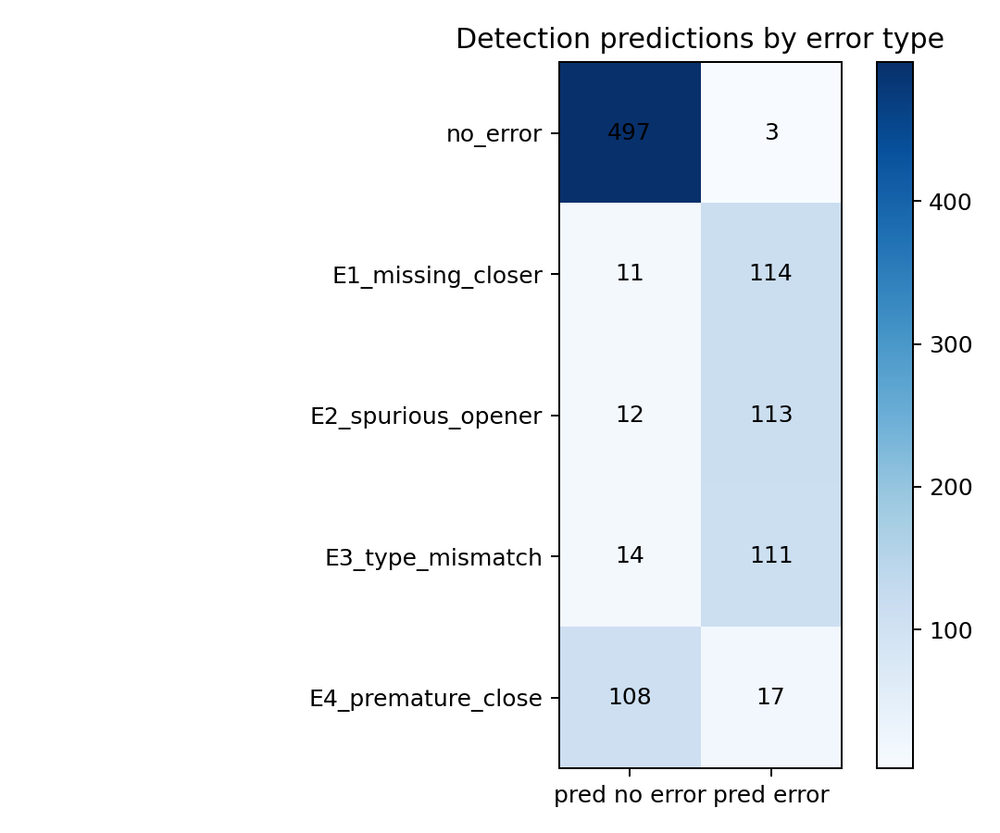
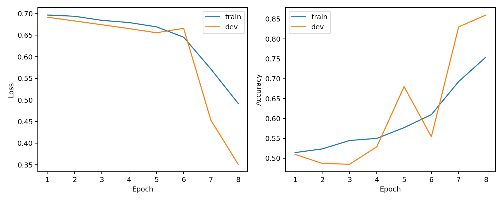
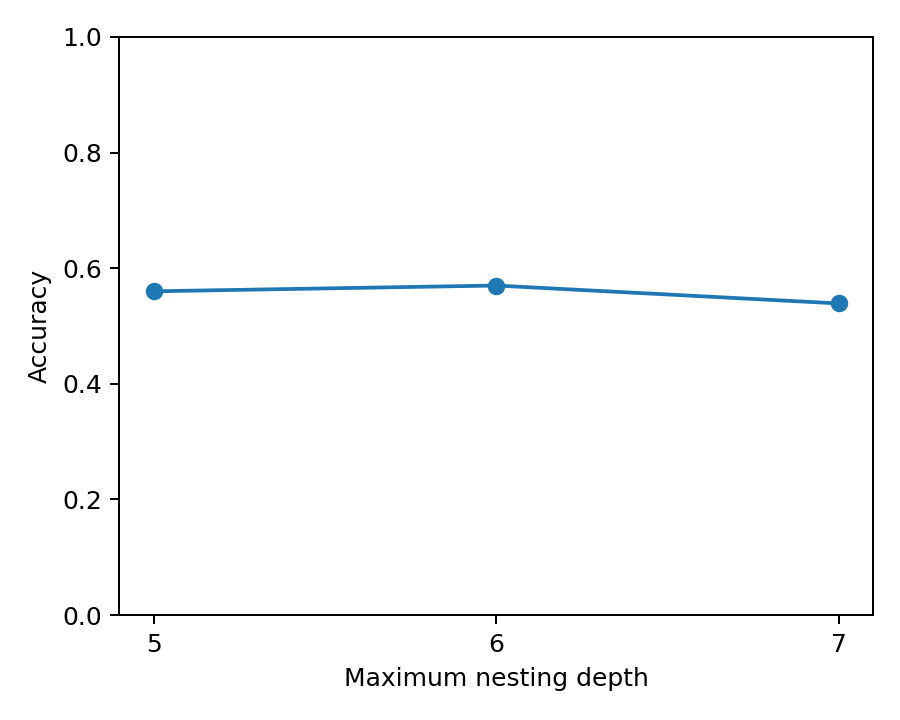
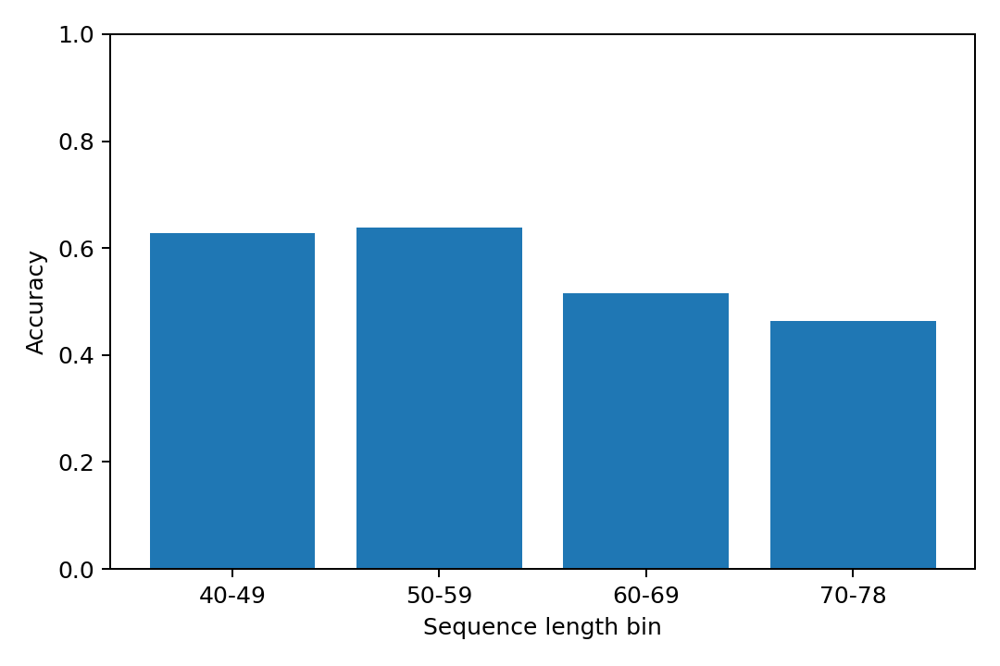
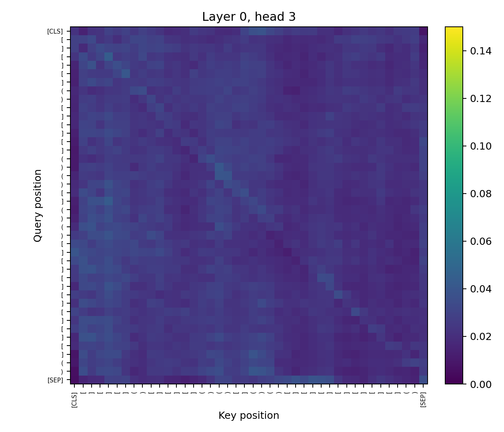
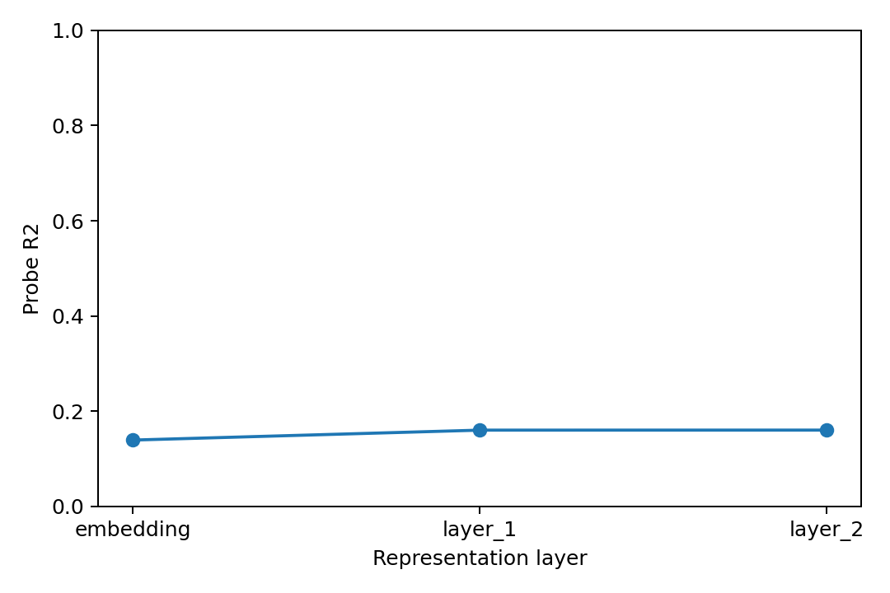
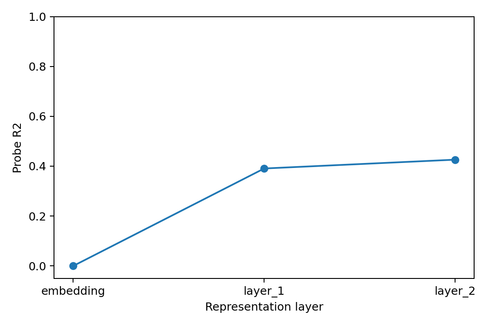
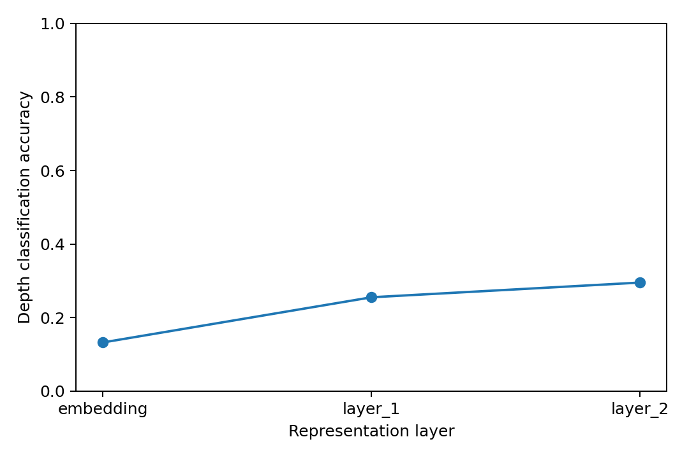
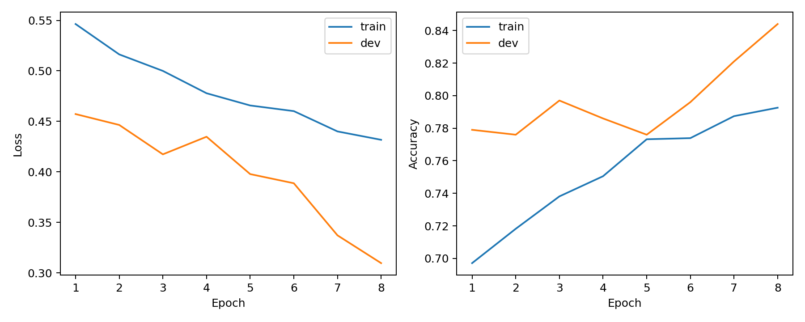

## 4. Theoretical Aspects

### 1. The Chomsky hierarchy and Dyck languages

The Chomsky hierarchy classifies formal languages according to the computational power needed
to recognise or generate them:

| Class | Grammar type | Recogniser |
|---|---|---|
| Type 3 | Regular languages | Finite-state automata |
| Type 2 | Context-free languages | Pushdown automata |
| Type 1 | Context-sensitive languages | Linear-bounded automata |
| Type 0 | Recursively enumerable languages | Turing machines |

Dyck languages are context-free languages. For example, the one-bracket Dyck language
`D(1)`, containing strings such as `()`, `(())`, and `()()`, is generated by the context-free
grammar

```text
S -> epsilon | SS | ( S )
```

For `k` bracket types, the grammar becomes

```text
S -> epsilon | SS | a_i S a_i_bar    for 1 <= i <= k
```

This grammar is context-free because every production rewrites a single nonterminal `S`
independently of its surrounding context. Dyck languages are generally not regular, because a
finite-state automaton cannot keep track of an unbounded number of unmatched opening brackets.
Recognising a Dyck string requires stack-like memory: every opener must be pushed, and every
closer must match the most recent unmatched opener. This is exactly the kind of memory provided
by a pushdown automaton.

`D(2)` has a special theoretical role: every context-free language can be obtained as a
homomorphic image of the intersection between `D(2)` and some regular language `R`. Informally,
this means that the two-type Dyck language is expressive enough to encode the derivational
structure of any context-free grammar, while the regular language `R` filters out only the
well-formed encodings that correspond to valid derivations of the target grammar. A homomorphism
then maps those encoded bracket structures back to the terminal strings of the original language.

So the construction has three parts:

1. `D(2)` supplies the universal nested, stack-like structure.
2. A regular constraint `R` selects the encodings that correspond to the desired context-free
   grammar.
3. A homomorphism erases or renames symbols to recover the original context-free language.

This makes Dyck languages a natural benchmark for structural generalisation. They isolate one
of the central difficulties of context-free syntax, that is unbounded hierarchical dependency. A model
that succeeds only on short or shallow Dyck strings may have learned surface statistics, such as
frequent local bracket patterns. A model that succeeds on deeper nesting than it saw during
training has stronger evidence of learning a more rule-like stack discipline. In this lab, this
is exactly why training on `D(2, n <= 4)` and testing on `D(2, n in {5, 6, 7})` is informative:
the OOD split tests whether the Transformer has learned a reusable structural rule or merely
memorised the training distribution.

### 2. Concrete examples

#### Example 1: Parentheses, brackets, and braces in source code

Programming languages contain many nested delimiter structures, for example, parentheses in function calls,
square brackets in indexing, braces in blocks, and angle brackets in some type systems. If we
abstract away from the internal tokens and keep only the delimiters, the well-formedness
condition is essentially a Dyck language with several bracket types.

For example, the Python expression

```python
result = f(arr[i], (x + y))
``` 
has the delimiter projection
```text
( [ ] ( ) )
```
which is a well-balanced Dyck string. Similarly, in C-like languages, nested blocks and function
calls produce strings over bracket types such as `()`, `[]`, and `{}`.

The four error types correspond naturally to common programming mistakes:

| Dyck error type | Software-engineering analogue |
|---|---|
| E1 Missing closer | Forgetting a closing parenthesis, bracket, or brace, e.g. `f(x, y` |
| E2 Spurious opener | Adding an extra opening delimiter, e.g. `f((x, y)` |
| E3 Type mismatch | Closing with the wrong delimiter, e.g. `arr[i)` instead of `arr[i]` |
| E4 Premature close | Writing a closing delimiter before anything has opened, e.g. `)x + y(` |

In real compilers and IDEs, these errors are often diagnosed by a stack-like parser. Openers are
pushed onto a stack, and closers must match the top of the stack.

#### Example 2: Nested markup in HTML or XML

Markup languages such as HTML and XML also have nested paired delimiters. If we treat an opening
tag as an opening bracket and its corresponding closing tag as the matching closing bracket, then
well-formed documents again reduce to a Dyck-like language. For example,

```html
<div><em>text</em><span>more</span></div>
```

has the abstract structure

```text
div_open em_open em_close span_open span_close div_close
```

which behaves like a multi-type Dyck string. The difference from the toy setting is that the
number of possible tag types can be large, but the basic stack discipline is the same.

The error types have direct markup analogues:

| Dyck error type | Markup analogue |
|---|---|
| E1 Missing closer | Missing a closing tag, e.g. `<div><em>text</em>` |
| E2 Spurious opener | Extra unclosed opening tag, e.g. `<div><span><em>text</em></div>` |
| E3 Type mismatch | Closing the wrong tag, e.g. `<div><em>text</div></em>` |
| E4 Premature close | A closing tag appears before its opener, e.g. `</span><div>text</div>` |

This example is especially close to the Dyck task because validating nested tags requires
remembering not only how many constituents are open, but also their types and order. A model must
therefore learn more than a simple count, that is to say, it must learn a last-in-first-out matching relation.

#### Alternative computational-linguistics example: constituency syntax

Constituency parse trees can also be represented with brackets. For instance,

```text
(S (NP the dog) (VP chased (NP the cat)))
```

is well-formed only if every opened constituent is eventually closed in the correct order. A
missing closing bracket corresponds to an incomplete constituent; a spurious opener corresponds
to an extra phrase boundary; a type mismatch corresponds to ending the wrong syntactic category;
and a premature close corresponds to closing a constituent that was never opened. Natural
language syntax is not just Dyck structure, but Dyck languages capture the nested dependency
component that parsers must handle.

### 3. (bonus) LSTMs, memory, Transformers for Dyck languages

For `D(1)`, there is only one bracket type. Recognising a string only requires checking a counter:

1. Increment the counter when an opener `(` is read.
2. Decrement it when a closer `)` is read.
3. Reject if the counter ever becomes negative.
4. Accept if the final counter is zero.

If the maximum nesting depth is bounded by `n`, then the counter only needs to represent values
from `0` to `n`. In practice, an LSTM with hidden dimension `h` can encode this bounded counter
in its continuous hidden state, at least for depths within the range seen during training. This could explain why `D(1)` is relatively easy. the model does not need to remember a sequence of bracket types, only the current depth.

For `D(k)` with `k >= 2`, counting is no longer sufficient. The model must remember the type of
each currently unmatched opener, in last-in-first-out order. For example, ([]) and [()] may have the same depth profile, but they require different future closing brackets. At depth
`n`, there are `k^n` possible stacks of opener types. A recogniser must distinguish among these
possible stacks, because the correct next closer depends on the top of the stack, and later
closers depend on the lower stack elements.

Formally, consider prefixes consisting of `n` openers over `k` types. There are `k^n` different
prefixes:

```text
a_i1 a_i2 ... a_in
```

Each prefix determines a unique sequence of valid closers:

```text
abar_in ... abar_i2 abar_i1
```

If two different opener stacks were mapped to the same internal memory state, the recogniser
would have to give the same decision for all possible continuations from that state. But because
the two stacks differ at some position, there exists a closing continuation that is valid for one
stack and invalid for the other. Therefore, an exact recogniser needs enough memory states to
distinguish all possible stacks up to depth `n`. The amount of information needed grows as log2(k^n) = n log2(k) bits. Thus, for `k >= 2`, the memory requirement grows linearly with the nesting depth `n`.

An LSTM with fixed hidden dimension has fixed-size continuous memory. In theory, real-valued
states can encode very large amounts of information with arbitrary precision, but in realistic
finite-precision computation and finite-data training, this is not a reliable unbounded stack.
So an LSTM may learn to recognise `D(k)` for bounded depths, but its ability to generalise to
larger unseen depths is limited by whether it has learned a true stack-like algorithm rather than
a depth-specific encoding.

For a Transformer with fixed width and fixed number of layers, the situation is also constrained.
Self-attention gives every token direct access to every other token, which is useful for bracket
matching. However, the model still has fixed-dimensional token representations and a fixed
number of computation steps. If training only covers depths up to `n <= 4`, the model may learn
attention patterns that work well for shallow examples, such as attending to nearby matching
brackets or memorising frequent local configurations. Nothing in a standard fixed-width
Transformer forces it to implement an unbounded pushdown stack.

This implies that OOD generalisation to deeper nesting is not guaranteed. If the Transformer has
learned a reusable rule, performance should degrade little when moving from `n <= 4` to
`n = 5, 6, 7`. If it has learned shortcuts tied to the training distribution, performance should
drop as depth and length increase. The OOD experiments in this lab are therefore a test of
whether the model's internal representations behave like an algorithmic stack or like a
collection of bounded-depth pattern recognisers.

## 5. Training and in-distribution evaluation

### 4. Train a binary classifier with [CLS] and error detection.

I implemented the binary detection model in `lab4_detection.py`. The script contains:

- synthetic Dyck string generation for the two bracket types `()` and `[]`;
- the four corruption operations E1-E4;
- tokenisation with `[CLS]`, `[SEP]`, and `[PAD]`, padded to length 80;
- a small BERT-style Transformer encoder;
- binary classification from the final `[CLS]` representation;
- accuracy, macro-F1, training curves, and confusion matrices.

For detection, I used a balanced binary split, 50% correct strings and 50% corrupted strings.
The corrupted half is itself balanced across E1-E4. This avoids the trivial majority-class
solution that would arise if the five descriptive categories were all equally frequent, since
that would make 80% of the examples erroneous.

The model architecture was:

| Hyperparameter | Value |
|---|---:|
| Layers | 2 |
| Attention heads | 4 |
| Hidden dimension | 64 |
| Feed-forward dimension | 256 |
| Dropout | 0.1 |
| Positional encoding | Sinusoidal |
| Maximum sequence length | 80 |

The lab handout recommends 50,000 training examples and 5,000 examples for development and test.
Because of time and compute constraints, the experiments in this report use a reduced setup:
10,000 training examples, 1,000 development examples, and 1,000 test examples for the main
detection run. The results should therefore be read as preliminary but informative, rather than
as a full-scale reproduction of the recommended setting.

The detection experiment was run as follows:

```bash
python3 lab4_detection.py \
  --train-size 10000 \
  --dev-size 1000 \
  --test-size 1000 \
  --epochs 8 \
  --batch-size 128 \
  --output-dir artifacts/detection
```

The test results were:
  
| Metric | Value |
|---|---:|
| Accuracy | 0.852 |
| Macro-F1 | 0.849 |
| Test loss | 0.358 |

The binary confusion matrix was:

| | Predicted no error | Predicted error |
|---|---:|---:|
| Gold no error | 497 | 3 |
| Gold error | 145 | 355 |

Broken down by error type:
  
| Error type | Predicted no error | Predicted error |
|---|---:|---:|
| No error | 497 | 3 |
| E1 Missing closer | 11 | 114 |
| E2 Spurious opener | 12 | 113 |
| E3 Type mismatch | 14 | 111 |
| E4 Premature close | 108 | 17 |

The easiest errors were E1, E2, and E3. E1 and E2 change the length parity of the sequence: a
well-formed Dyck string must have even length, while deleting one closer or inserting one opener
creates an odd-length sequence. E3 introduces a relatively local inconsistency, since a closer of
the wrong type conflicts with the expected opener type.

E4 was systematically harder in this run, but this should not be explained by the absence of a
length-parity cue. E4 is also implemented as an insertion, so it changes the length parity just as
E2 does. The low E4 detection rate therefore suggests either that the model did not use the parity
cue reliably, or that this particular E4 generation/distribution deserves additional inspection.
As a data sanity check, the generated E4 examples were also evaluated with the deterministic PDA
baseline and were correctly classified as invalid in that evaluation. Still, this result should be
interpreted cautiously rather than as evidence that E4 is intrinsically harder because it lacks a
simple length cue.

I initially expected E4 to be easy, since a premature closer violates prefix well-formedness. The
confusion matrix showed the opposite, which made me check whether the model was really exploiting
simple length or parity cues. The answer seems to be: not reliably.

The training curves and confusion matrix were saved to:

```text
artifacts/detection/training_curves.png
artifacts/detection/confusion_by_error_type.png
artifacts/detection/metrics.json
```



The model improved substantially late in training: development accuracy moved from approximately
0.51 after the first epoch to 0.86 after the eighth epoch. There is no strong evidence of
over-fitting in this preliminary run, since development loss continued to decrease by the final
epoch. The regularisation used here was dropout `0.1`, AdamW weight decay `0.01`, and gradient
clipping with maximum norm `1.0`.

### 5. Error correction as sequence labelling

I implemented the local correction formulation in `lab4_correction.py`. Each input is the
possibly corrupted sequence, and each token receives one edit label. I used the following label
set:

```text
OK
DELETE
INSERT_x
REPLACE_x
```

where `x` is one of the bracket tokens. In the current corruption scheme, only a subset of these
labels is actually needed: missing closers require `INSERT_)` or `INSERT_]`; type mismatches
require `REPLACE_)` or `REPLACE_]`; spurious openers and premature closers require `DELETE`.

The precise local convention is:

- `OK`: keep the current token;
- `DELETE`: remove the current token;
- `REPLACE_x`: replace the current token with `x`;
- `INSERT_x`: insert `x` after the current token.

For E1, where a closer has been deleted, the insertion label is placed on the token immediately
before the missing closer. For E2 and E4, the inserted corrupted token is labelled `DELETE`. For
E3, the mismatched closer is labelled `REPLACE_x`, where `x` is the original correct closer.

I trained the same small Transformer encoder as in the detection experiment, but with a token
classifier on top of every contextual representation. Because `OK` labels are overwhelmingly
more frequent than edit labels, I used inverse-square-root class weighting in the loss.

The experiment was run with:

```bash
python3 lab4_correction.py \
  --train-size 10000 \
  --dev-size 1000 \
  --test-size 1000 \
  --epochs 20 \
  --batch-size 128 \
  --weight-power 0.5 \
  --output-dir artifacts/correction
```

The test results were:

| Metric | Value |
|---|---:|
| Token-level accuracy | 0.909 |
| Exact-match accuracy | 0.509 |
| Test loss | 0.311 |

Exact-match by type:

| Error type | Exact-match accuracy |
|---|---:|
| No error | 1.000 |
| E1 Missing closer | 0.000 |
| E2 Spurious opener | 0.008 |
| E3 Type mismatch | 0.048 |
| E4 Premature close | 0.016 |

These results show why token-level accuracy is misleading for this task. Most tokens require no
edit, so a model can obtain high token accuracy by predicting `OK` almost everywhere. Exact-match
accuracy is much stricter: one wrong edit decision is enough to make the whole corrected string
incorrect. The model preserves correct strings very well, but it does not yet reliably repair
corrupted ones.

It is important to separate the no-error cases from the corrupted cases. The overall exact-match
accuracy of `0.509` is mostly explained by the no-error examples, for which exact-match is
`1.000`. Since the dataset is balanced with 50% correct strings, an always-`OK` or no-edit
baseline would already obtain about `0.50` exact-match accuracy by leaving all correct strings
unchanged. On corrupted strings only, the model succeeds on only about `0.018` of examples:

| Subset | Exact-match accuracy |
|---|---:|
| All examples | 0.509 |
| No-error examples | 1.000 |
| Corrupted examples only | 0.018 |
| Approx. no-edit baseline | 0.500 |

Thus, the correction experiment should be interpreted as a formulation and diagnostic baseline,
not as a successful repair system. It shows that the local labelling setup can be implemented and
evaluated, but the trained model almost never repairs corrupted strings exactly.

To show what a more appropriate correction procedure can achieve in this controlled setting, I
also added a constrained single-edit repair baseline to `lab4_correction.py`. It enumerates all
strings reachable by one edit from the corrupted input and keeps a candidate only if it is
accepted by the deterministic Dyck PDA. This is not a neural sequence labeller, but it matches the
structure of the lab task much better: there is exactly one corruption, and the corrected output
should be a valid Dyck string.

| Method | Exact-match | Corrupted-only exact-match | Valid Dyck output rate |
|---|---:|---:|---:|
| No-edit baseline | 0.500 | 0.000 | 0.500 |
| Neural local labeller | 0.509 | 0.018 | not constrained |
| PDA single-edit repair | 0.744 | 0.488 | 1.000 |

The PDA repair baseline is much closer to the ideal correction behaviour: every output is a valid
Dyck string. Its exact match against the original clean string is lower than its validity rate
because exact reconstruction is sometimes ambiguous. This is especially visible for E1 missing
closers, where several insertion positions may restore a valid Dyck string even if only one
matches the original pre-corruption string.

PDA single-edit exact-match by type:

| Error type | Exact-match accuracy |
|---|---:|
| No error | 1.000 |
| E1 Missing closer | 0.000 |
| E2 Spurious opener | 0.680 |
| E3 Type mismatch | 0.464 |
| E4 Premature close | 0.808 |

PDA single-edit valid-output rate by type:

| Error type | Valid Dyck output rate |
|---|---:|
| No error | 1.000 |
| E1 Missing closer | 1.000 |
| E2 Spurious opener | 1.000 |
| E3 Type mismatch | 1.000 |
| E4 Premature close | 1.000 |

This makes the E1 result less surprising. For E1, the baseline always restores a valid Dyck
string, but it does not know the original deletion position. Exact reconstruction can therefore
fail even when the validity objective is satisfied.

This comparison changes how I interpret the correction part of the lab. The local sequence
labelling model completes the requested formulation and evaluation, but it is not a good repair
system in this small run. The constrained PDA repair baseline is the stronger correction result
and should be used as the reference point for what is achievable when the grammar constraint is
used explicitly.

This local sequence-labelling formulation has several limitations.

First, it is extremely class-imbalanced. In a sequence of length 40 with exactly one corruption,
only one token usually has a non-`OK` label. As a result, token-level accuracy mostly measures
whether the model learned to leave tokens untouched, not whether it learned to correct errors.

Second, local labels are not always a natural representation of a structural repair. A missing
closer is an absence, not an observed token. Placing `INSERT_x` on the previous token is an
implementation convention, but the true evidence for the missing closer may be distributed across
the whole stack structure.

Third, the formulation predicts edits independently at each position. It does not enforce that
the final edited string is a valid Dyck string, nor that there is exactly one correction. The model
can therefore produce multiple incompatible edits, or no edit at all. A constrained decoder or a
parser-based repair system would be better suited to enforcing global well-formedness.

Finally, exact correction may require distinguishing several globally plausible repairs. For
example, inserting a missing closer at one position versus another can both improve local balance
but produce different full strings. The local classifier has no explicit mechanism for comparing
complete candidate repairs.

The correction metrics were saved to:

```text
artifacts/correction/metrics.json
artifacts/correction/model.pt
```

### 6. Training curves, convergence, and regularisation

The training curves for the binary detection model are saved in:

```text
artifacts/detection/training_curves.png
```



The detection model converged fairly cleanly. The first epoch was close to chance, with training
accuracy `0.514` and development accuracy `0.510`. By epoch 8, training accuracy had reached
`0.754`, while development accuracy reached `0.860`. The development loss also decreased from
`0.691` to `0.351`.

This run does not show strong over-fitting. In fact, the development score is higher than the
training score at the end of training. This can happen because the training metric is accumulated
while the model is still being updated within the epoch, whereas the development metric is
computed after the full epoch with dropout disabled. More importantly, the development loss is
still decreasing at epoch 8, so the model has probably not reached its best possible
in-distribution performance.

The correction curves are saved in:

```text
artifacts/correction/training_curves.png
```

For correction, the loss also decreases steadily: training loss moves from `1.011` to `0.344`,
and development loss moves from `0.773` to `0.303`. However, the task-level behaviour is less
satisfactory. Development token accuracy starts very high, around `0.976`, because most labels
are `OK`, then decreases to around `0.913` as the weighted loss encourages the model to predict
more edit labels. Exact-match accuracy remains almost flat, moving only from `0.490` to `0.516`.

This means that the correction model is learning something about rare edit labels, but not enough
to produce globally correct repairs. The loss curve alone is therefore not sufficient: for this
task, exact-match accuracy is the more meaningful metric.

The regularisation strategies used in both models were:

- dropout `0.1` inside the Transformer encoder;
- AdamW weight decay `0.01`;
- gradient clipping with maximum norm `1.0`;
- small model size, with 2 layers and hidden dimension 64.

For correction, I also used inverse-square-root class weighting to compensate for the dominance
of the `OK` label. A stronger inverse-frequency weighting was tested, but it over-corrected: the
model began editing correct strings and exact-match accuracy collapsed. The final setting is
therefore a compromise between learning rare edits and preserving already-correct sequences.

## 6. Out-of-distribution generalisation

### 7. Direct evaluation on deeper nesting

I implemented OOD evaluation in `lab4_ood.py`. The script loads the trained binary detection
model from `artifacts/detection/model.pt` and evaluates it on strings with exact maximum nesting
depth `n = 5, 6, 7`.

One implementation detail is important: the detection model was trained with `max_len = 80`,
including `[CLS]` and `[SEP]`. To avoid truncating the raw bracket strings during OOD evaluation,
I used raw lengths from 40 to 78 rather than 40 to 80.

Another data-generation detail matters for the OOD split. The generator from the handout only
guarantees maximum depth `<= n`. For experiments described as exact depth `n`, I explicitly
computed `max_depth(string)` and rejected samples whose actual maximum depth was not exactly `n`.
This is used for the OOD evaluations at depths 5, 6, and 7, and for the depth-5 fine-tuning
experiment. In contrast, the length-augmentation experiment deliberately keeps the training bound
at `n <= 4`, so it may include depths 1-4 but not deeper strings.

The evaluation command was:

```bash
python3 lab4_ood.py \
  --examples-per-depth 1000 \
  --output-dir artifacts/ood
```

The overall OOD accuracy was:

| Split | Accuracy |
|---|---:|
| In-distribution test | 0.852 |
| OOD test, `n in {5,6,7}` | 0.556 |

Accuracy as a function of maximum nesting depth:

| Depth | Accuracy |
|---:|---:|
| 5 | 0.560 |
| 6 | 0.570 |
| 7 | 0.539 |

Accuracy as a function of sequence length:

| Length bin | Accuracy |
|---|---:|
| 40-49 | 0.629 |
| 50-59 | 0.639 |
| 60-69 | 0.516 |
| 70-78 | 0.464 |

The plots are saved in:

```text
artifacts/ood/accuracy_by_depth.png
artifacts/ood/accuracy_by_length.png
artifacts/ood/metrics.json
```





The model clearly does not generalise robustly out of distribution. Accuracy drops from `0.852`
in distribution to `0.556` on deeper and longer OOD strings. The degradation is not neatly
linear in depth: performance is similar for depths 5 and 6, then slightly worse for depth 7.
The length trend is more revealing. Accuracy is still above chance for lengths 40-59, but falls
near chance for 60-69 and below chance for 70-78.

I read this as a failure of length-invariant generalisation. The model probably relies on patterns
that are useful within the training range, such as local bracket configurations, length cues, and
shallow-depth regularities. Once sequences become substantially longer, those heuristics stop
being reliable. The performance drop is therefore closer to an abrupt length-driven failure than
to a smooth, rule-like degradation with nesting depth.

### 8. Pushdown automaton baseline

I implemented the deterministic pushdown automaton baseline in `lab4_pda_baseline.py`. The
algorithm is the exact Dyck membership test:

1. Scan the sequence from left to right.
2. Push each opener onto a stack.
3. When a closer is read, reject if the stack is empty.
4. Otherwise pop the top opener and check that it matches the closer type.
5. Accept if and only if the stack is empty at the end.

The command was:

```bash
python3 lab4_pda_baseline.py \
  --id-size 1000 \
  --ood-size-per-depth 1000 \
  --output-dir artifacts/pda
```

The PDA results were:

| Split | Accuracy |
|---|---:|
| In-distribution | 1.000 |
| OOD depth 5 | 1.000 |
| OOD depth 6 | 1.000 |
| OOD depth 7 | 1.000 |
| OOD overall | 1.000 |

The baseline also achieves perfect accuracy for every error type E1-E4. The metrics are saved in:

```text
artifacts/pda/metrics.json
```

I also added a parity-only detection baseline. It predicts "error" if the raw bracket string has
odd length and "no error" otherwise. This baseline is intentionally simple: it checks whether the
Transformer is being compared against a cheap shortcut. In this data setup, E1, E2, and E4 change
length parity, while E3 type mismatches do not.

The comparison with the Transformer and PDA is:

| Model | In-distribution accuracy | OOD accuracy |
|---|---:|---:|
| Parity-only baseline | 0.875 | 0.875 |
| Transformer detector | 0.852 | 0.556 |
| Pushdown automaton | 1.000 | 1.000 |

Parity-only accuracy by error type is:

| Error type | Accuracy |
|---|---:|
| No error | 1.000 |
| E1 Missing closer | 1.000 |
| E2 Spurious opener | 1.000 |
| E3 Type mismatch | 0.000 |
| E4 Premature close | 1.000 |

This is a useful sanity check. The parity baseline is very strong because three of the four
corruption types change string length parity. The Transformer does not even match this shortcut
on the OOD split, so its poor OOD behaviour cannot be explained as a robust use of parity alone.
It also explains why E3 is the important non-parity error type: detecting E3 requires more than
odd/even length.

This reveals an important difference between solving the task extensionally and solving it
algorithmically. The PDA has an explicit stack, so the same computation applies regardless of
sequence length or nesting depth. Its representation is symbolic and invariant to the training
distribution.

The Transformer, by contrast, learns distributed vector representations from bounded data. Even
though self-attention can compare distant tokens, the model is not forced to implement a stack.
Its poor OOD performance suggests that the learned representation captures useful
in-distribution correlations, but not the exact recursive rule for Dyck membership. In other
words, the Transformer approximates the language well inside the training regime, while the PDA
recognises the language by construction.

### 9. Fine-tuning on 500 examples with depth 5

I implemented the fine-tuning experiment in `lab4_finetune_ood.py`. Starting from the trained
binary detector, I fine-tuned on 500 examples with exact maximum nesting depth `n = 5`, then
evaluated on fresh OOD examples with depths 5, 6, and 7.

The command was:

```bash
python3 lab4_finetune_ood.py \
  --finetune-size 500 \
  --eval-size-per-depth 1000 \
  --epochs 10 \
  --output-dir artifacts/finetune_ood
```

The results were:

The absolute "before" numbers in this table are not identical to the OOD numbers in question 7
because each script generated a fresh synthetic OOD evaluation sample, although with fixed random
seeds. Comparisons should therefore be read within each table. A cleaner follow-up would persist
one shared OOD JSONL split and reuse it across all scripts.

| Depth | Before fine-tuning | After fine-tuning | Delta |
|---:|---:|---:|---:|
| 5 | 0.598 | 0.615 | +0.017 |
| 6 | 0.553 | 0.613 | +0.060 |
| 7 | 0.568 | 0.635 | +0.067 |

The metrics and plot are saved in:

```text
artifacts/finetune_ood/metrics.json
artifacts/finetune_ood/before_after_accuracy.png
```

Fine-tuning on `n = 5` improves performance not only on depth 5 but also on depths 6 and 7. There
is some transfer from the new examples, but it is modest: even after fine-tuning, accuracy remains
around `0.61-0.64`, far below the PDA baseline.

I would call this weak transfer rather than strong compositional generalisation. If the model had
learned the true recursive rule from the `n = 5` examples, I would expect a larger and more stable
gain on `n = 6` and `n = 7`. Instead, the model seems to adapt to some broader properties of the
OOD regime, such as longer sequences and deeper local bracket patterns, without acquiring a fully
depth-invariant stack algorithm.

## 7. Attention analysis

### 10. Average attention matrices and bracket matching heads

I implemented attention extraction in `lab4_attention.py`. Since PyTorch's standard
`TransformerEncoderLayer` does not return attention weights by default, the script manually
replays the encoder forward pass and calls each layer's `self_attn` module with
`average_attn_weights=False`. This gives one attention matrix per layer and per head.

The analysis used 100 correct Dyck strings of length 40:

```bash
python3 lab4_attention.py \
  --num-examples 100 \
  --length 40 \
  --output-dir artifacts/attention
```

The attention plots are saved as:

```text
artifacts/attention/layer_0_head_0.png
artifacts/attention/layer_0_head_1.png
artifacts/attention/layer_0_head_2.png
artifacts/attention/layer_0_head_3.png
artifacts/attention/layer_1_head_0.png
artifacts/attention/layer_1_head_1.png
artifacts/attention/layer_1_head_2.png
artifacts/attention/layer_1_head_3.png
```




For each matched pair `(i, j)`, I computed:

```text
alpha_i->j = A[i, j]
alpha_j->i = A[j, i]
```

where `i` is the opener position, `j` is the matched closer position, and `A` is the attention
matrix for a given head. Because the analysed sequences have length 40 plus `[CLS]` and `[SEP]`,
a roughly uniform attention baseline is approximately:

```text
1 / 42 = 0.0238
```

The strongest heads by bidirectional matched-pair attention were:

| Layer | Head | Mean matched-pair attention |
|---:|---:|---:|
| 0 | 3 | 0.0284 |
| 0 | 1 | 0.0240 |
| 1 | 0 | 0.0237 |
| 0 | 2 | 0.0228 |
| 1 | 3 | 0.0219 |

Detailed opener-to-closer and closer-to-opener scores for the strongest head were:

| Layer | Head | `alpha_i->j` mean | `alpha_i->j` std | `alpha_j->i` mean | `alpha_j->i` std |
|---:|---:|---:|---:|---:|---:|
| 0 | 3 | 0.0404 | 0.0143 | 0.0164 | 0.0144 |

The results do not show a clean bracket-matching head. Layer 0 head 3 attends from openers to
their matching closers slightly more than uniform attention, but the effect is modest and
asymmetric: closers do not strongly attend back to their openers. Most other heads are at or
below the uniform baseline.

This lines up with the OOD results: the model can solve many in-distribution examples, but the
attention plots do not expose an explicit bracket-pairing mechanism. The useful computation may
be distributed across heads and layers, or the model may mainly rely on shallower statistical
cues rather than systematic matching.

The attention metrics are saved in:

```text
artifacts/attention/metrics.json
```

### 11. Attention patterns on erroneous strings

I implemented the erroneous-string attention analysis in `lab4_attention_errors.py`. The script
generates corrupted strings, records the corrupted position, extracts attention for the same
head that had the highest matched-pair score in the previous section, and compares the corrupted
position to a random control position in the same sequence.

The command was:

```bash
python3 lab4_attention_errors.py \
  --examples-per-type 25 \
  --length 40 \
  --layer 0 \
  --head 3 \
  --output-dir artifacts/attention_errors
```

For E1, the missing closer is not an observed token, so I anchored the error position to the
token immediately before the deletion point. For E2, E3, and E4, the error position is the
inserted or replaced token.

The script saves local attention windows centred on the corrupted position:

```text
artifacts/attention_errors/E1_missing_closer_local_window.png
artifacts/attention_errors/E2_spurious_opener_local_window.png
artifacts/attention_errors/E3_type_mismatch_local_window.png
artifacts/attention_errors/E4_premature_close_local_window.png
```

The numerical summary for layer 0 head 3 was:

| Error type | Error incoming | Control incoming | `[CLS] -> error` | `[CLS] -> control` | Error local mass | Control local mass |
|---|---:|---:|---:|---:|---:|---:|
| E1 Missing closer | 0.0237 | 0.0226 | 0.0224 | 0.0231 | 0.161 | 0.155 |
| E2 Spurious opener | 0.0226 | 0.0280 | 0.0166 | 0.0290 | 0.156 | 0.164 |
| E3 Type mismatch | 0.0215 | 0.0223 | 0.0248 | 0.0215 | 0.137 | 0.160 |
| E4 Premature close | 0.0269 | 0.0213 | 0.0294 | 0.0231 | 0.159 | 0.152 |

The same weak matching head does not become a clean error-localisation head on erroneous strings.
Most differences between corrupted and control positions are small. E4 is the clearest exception:
the premature closer receives higher incoming attention and more attention from `[CLS]` than the
control position. A cautious reading is that the model sometimes routes information from globally
salient anomalies toward the classification token.

However, the effect is not strong enough to support a claim that attention directly implements
error localisation. E2 even shows the opposite tendency: the corrupted opener receives less
`[CLS]` attention than the control position. E3 has slightly higher `[CLS] -> error` attention,
but lower local attention mass around the corrupted position.

My hypothesis is therefore cautious: attention may participate in localising some errors,
especially premature closes that violate prefix well-formedness, but the model does not use a
stable, interpretable attention pattern that corresponds to the symbolic stack algorithm. Error
evidence is likely distributed across several heads and representations, rather than concentrated
in one obvious matching head.

The metrics are saved in:

```text
artifacts/attention_errors/metrics.json
```

### 12. Bonus: attention rollout to `[CLS]`

I implemented attention rollout in `lab4_attention_rollout.py`, following the usual idea of
combining attention matrices across layers. For each layer, I averaged over heads, added an
identity matrix to account for residual connections, row-normalised, and multiplied the resulting
matrices across layers. I then inspected the rollout row for `[CLS]`, which gives an approximate
measure of how much information from each input token flows into the classification token.

The command was:

```bash
python3 lab4_attention_rollout.py \
  --examples-per-type 50 \
  --length 40 \
  --output-dir artifacts/attention_rollout
```

The results compare the rollout weight of the corrupted position against ordinary non-special
tokens in the same sequence:

| Error type | Error weight | Control mean | Error/control | Error percentile |
|---|---:|---:|---:|---:|
| E1 Missing closer | 0.0181 | 0.0189 | 0.963 | 0.485 |
| E2 Spurious opener | 0.0170 | 0.0179 | 0.952 | 0.480 |
| E3 Type mismatch | 0.0216 | 0.0183 | 1.184 | 0.693 |
| E4 Premature close | 0.0201 | 0.0179 | 1.125 | 0.666 |

The rollout plots are saved in:

```text
artifacts/attention_rollout/E1_missing_closer_rollout.png
artifacts/attention_rollout/E2_spurious_opener_rollout.png
artifacts/attention_rollout/E3_type_mismatch_rollout.png
artifacts/attention_rollout/E4_premature_close_rollout.png
artifacts/attention_rollout/metrics.json
```

The result is mixed. Tokens involved in E3 and E4 receive somewhat larger rollout weights than
ordinary tokens: around `18%` higher for type mismatches and `12%` higher for premature closes.
They also sit around the 67th-69th percentile of token rollout weights. In this run, visible
closing-bracket anomalies therefore receive slightly more information flow into `[CLS]`.

However, E1 and E2 do not show this effect. For E1, the error is an absence rather than an
observed token, so anchoring the missing closer to a neighbouring token is necessarily imperfect.
For E2, the spurious opener does not receive elevated rollout weight in this run. Thus, attention
rollout gives weak evidence that some error tokens become more salient to `[CLS]`, but the effect
is neither universal nor strong enough to count as a reliable localisation mechanism.

## 8. Probing classifiers

### 13. Global depth probe

I implemented the global depth probe in `lab4_global_probe.py`. The script freezes the trained
Transformer detector, extracts the final-layer `[CLS]` representation for correct Dyck strings,
and trains two linear probes:

1. a linear regression probe predicting maximum nesting depth as a scalar;
2. a multinomial logistic-regression probe predicting depth as a discrete label in
   `{1, ..., 7}`.

The command was:

```bash
python3 lab4_global_probe.py \
  --examples-per-depth 500 \
  --output-dir artifacts/global_probe
```

The probe dataset was balanced across depths 1-7, with 500 examples per depth. I used a 70/30
train/test split for the probes. The Transformer itself was frozen.

The results were:

| Probe | Metric | Value |
|---|---|---:|
| Linear regression | `R^2` | 0.415 |
| Linear classification | Accuracy | 0.270 |

Chance accuracy for the 7-way classifier is approximately:

```text
1 / 7 = 0.143
```

Per-depth classification accuracy was:

| Depth | Accuracy |
|---:|---:|
| 1 | 0.549 |
| 2 | 0.234 |
| 3 | 0.231 |
| 4 | 0.118 |
| 5 | 0.147 |
| 6 | 0.196 |
| 7 | 0.385 |

The metrics are saved in:

```text
artifacts/global_probe/metrics.json
```

The regression result shows that maximum nesting depth is partially linearly recoverable from
the final `[CLS]` representation. An `R^2` of `0.415` is well above zero, so `[CLS]` does contain
some global depth information.

However, the classification result is weak. Accuracy `0.270` is above chance, but far from a
clean encoding of the seven depth classes. The classifier does especially poorly for middle
depths 4-6. The representation contains a rough signal correlated with depth, but not a sharply
separated linear code for exact maximum nesting depth.

This also fits the OOD results. The Transformer appears to encode some distributional features
related to depth, but not a precise symbolic depth variable that would support robust
generalisation to deeper nesting.

### 14. Local depth probe

I implemented the local depth probe in `lab4_local_probe.py`. For each token position `t`, the
target is the current nesting depth after reading the prefix up to that token:

```text
depth_t = number of unmatched openers in s_1 ... s_t
```

The script freezes the Transformer, extracts token representations from the embedding layer and
from each Transformer layer, and trains a linear ridge-regression probe for each layer.

The command was:

```bash
python3 lab4_local_probe.py \
  --examples-per-depth 300 \
  --output-dir artifacts/local_probe
```

This produced 100,632 token-level examples. The results were:

| Representation | Probe `R^2` |
|---|---:|
| Embedding + position | 0.139 |
| Layer 1 | 0.160 |
| Layer 2 | 0.160 |

The plot is saved in:

```text
artifacts/local_probe/r2_by_layer.png
artifacts/local_probe/metrics.json
```



The best local depth probe is at layer 2, but the difference between layer 1 and layer 2 is tiny.
The overall `R^2` is low. This means that current stack depth is only weakly linearly recoverable
from individual token representations.

This result is informative because local depth is exactly the kind of quantity that a stack-based
Dyck recogniser would maintain explicitly. If the Transformer had learned a clean stack-like
algorithm, we might expect local depth to become increasingly linearly decodable in later layers.
Instead, the probe improves only slightly over the positional/token embedding baseline. The model
therefore does not appear to store local depth as a simple linear feature of each contextual token
representation.

### 15. Probes on correct versus erroneous strings

I implemented the erroneous-string probing experiment in `lab4_probe_errors.py`. The probe is
trained on correct strings only, using the final token representations from layer 2. It is then
evaluated on:

1. held-out correct strings;
2. corrupted strings with known error positions.

For erroneous strings, I used the corrupted prefix balance as the target depth signal. This means
that an inserted premature closer can make the balance drop too early, and a missing closer can
make the later balance too high. This is not a perfect semantic target for "intended" repair, but
it tests whether the model representation tracks the actually observed prefix structure.

The command was:

```bash
python3 lab4_probe_errors.py \
  --train-examples-per-depth 300 \
  --test-examples-per-depth 100 \
  --error-examples-per-type 100 \
  --layer-index 2 \
  --output-dir artifacts/probe_errors
```

The probe performance on held-out correct strings was:

| Metric | Value |
|---|---:|
| `R^2` | 0.153 |
| Mean absolute error | 1.285 |

On erroneous strings, the global `R^2` against corrupted prefix balance was negative:

| Metric | Value |
|---|---:|
| `R^2` | -0.218 |

Mean absolute error before, at, and after the corrupted position:

| Error type | Before | At error | After |
|---|---:|---:|---:|
| E1 Missing closer | 1.073 | 0.949 | 0.756 |
| E2 Spurious opener | 1.126 | 0.876 | 0.722 |
| E3 Type mismatch | 1.039 | 1.217 | 1.212 |
| E4 Premature close | 0.992 | 1.673 | 1.739 |

The E3 and E4 patterns are the most interpretable. For type mismatches and premature closes, the
probe error increases at and after the corrupted token. E4 is especially clear: the mean absolute
error rises from `0.992` before the error to `1.673` at the error and `1.739` after it. After the
prefix structure is corrupted, the representation becomes less compatible with the depth probe.

For E1 and E2, the pattern is less useful. The error is either an absence or an extra opener, and
the local depth probe does not show a clean breakdown after the corruption. That is not surprising
given that the local depth probe was already weak on correct strings.

I also tried using the probe residual as an unsupervised error-localisation score. For each
erroneous sequence, I ranked positions by absolute probe error and checked whether the true error
position had the largest residual.

| Error type | Mean rank of true error | Top-1 localisation accuracy |
|---|---:|---:|
| E1 Missing closer | 28.93 | 0.020 |
| E2 Spurious opener | 31.93 | 0.030 |
| E3 Type mismatch | 25.93 | 0.050 |
| E4 Premature close | 26.46 | 0.010 |

This localisation attempt fails. The true error position is rarely the position with the largest
probe residual. The reason is straightforward: local depth is not strongly linearly encoded in
the first place, so residuals from this weak probe are too noisy to serve as a reliable
localisation signal.

The metrics are saved in:

```text
artifacts/probe_errors/metrics.json
```

### 16. Bonus: layer-wise probes and progressive computation

I implemented the layer-wise global probe in `lab4_layerwise_global_probe.py`. This extends the
global depth analysis by probing `[CLS]` after the embedding layer, after layer 1, and after
layer 2. The local depth layer-wise results come from `lab4_local_probe.py`.

The global probe command was:

```bash
python3 lab4_layerwise_global_probe.py \
  --examples-per-depth 500 \
  --output-dir artifacts/layerwise_global_probe
```

Global maximum-depth probe results:

| Representation | Regression `R^2` | Classification accuracy |
|---|---:|---:|
| Embedding | -0.001 | 0.132 |
| Layer 1 | 0.391 | 0.255 |
| Layer 2 | 0.426 | 0.295 |

Local current-depth probe results:

| Representation | Local depth `R^2` |
|---|---:|
| Embedding | 0.139 |
| Layer 1 | 0.160 |
| Layer 2 | 0.160 |

The plots are saved in:

```text
artifacts/layerwise_global_probe/global_r2_by_layer.png
artifacts/layerwise_global_probe/global_accuracy_by_layer.png
artifacts/local_probe/r2_by_layer.png
```






The global depth probes show a progressive pattern. The embedding-level `[CLS]` representation
contains essentially no useful global depth information: regression `R^2` is around zero and
classification accuracy is close to chance. After the first Transformer layer, depth becomes much
more linearly decodable. After the second layer, it improves slightly further.

The local depth probes show a much weaker progression. Token-level current depth is already
weakly predictable from token and position embeddings, and the Transformer layers improve it only
slightly. I do not see evidence here for an explicit linear stack-depth variable at every token.

Overall, the results support a limited version of progressive computation. The model seems to
accumulate some global information into `[CLS]` across layers, but this is not matched by a clean
layer-by-layer construction of local stack state. In other words, the network develops a rough
global summary useful for classification, rather than a transparent symbolic computation of Dyck
depth at each position.

## 9. Open discussion

### 17. Rule learning versus statistical pattern memorisation

Based on the experiments above, I would not conclude that this Transformer has learned the full
Dyck membership rule. It has learned useful in-distribution regularities, but the evidence points
more toward bounded statistical pattern learning than toward a robust stack-like algorithm.

The strongest evidence comes from the OOD evaluation. In distribution, the binary detector
achieves accuracy `0.852`. On deeper and longer OOD strings, accuracy drops to `0.556`. The
performance drop is especially severe for long strings: the model reaches only `0.464` accuracy
on lengths 70-78. A true Dyck recogniser should not degrade in this way, because the membership
rule is the same at all depths and lengths.

The PDA comparison makes the contrast explicit:

| Model | In-distribution accuracy | OOD accuracy |
|---|---:|---:|
| Transformer detector | 0.852 | 0.556 |
| Pushdown automaton | 1.000 | 1.000 |

The PDA uses a stack, so its computation is depth-invariant. The Transformer does not show this
kind of invariance. Fine-tuning on 500 examples with depth 5 improves depths 6 and 7 slightly,
but final accuracies remain around `0.61-0.64`. I read that as weak transfer to the broader OOD
regime, not acquisition of the exact recursive rule.

The attention analysis points in the same direction. If the model had learned a transparent
bracket-matching algorithm, we might expect one or more attention heads to strongly connect
matched openers and closers. Instead, the strongest matched-pair head has only modest attention
above the uniform baseline, and the effect is asymmetric. Attention rollout gives some extra
salience to E3 and E4 error tokens, but not to E1 and E2. Thus, attention does not reveal a stable
symbolic matching mechanism.

The probing results also support a cautious conclusion. Maximum depth is partially recoverable
from `[CLS]`, with global regression `R^2` around `0.415`, and the layer-wise global probe shows
that this information becomes more available after the Transformer layers. However, local depth
is only weakly recoverable from token representations, with `R^2` around `0.160`. Since a
stack-based recogniser would naturally maintain local depth and opener type information, the weak
local probe result is evidence against a clean internal stack representation.

The correction experiment is another warning sign. Token-level correction accuracy is high, but
exact-match accuracy is only `0.509`, barely above the "leave correct strings alone" baseline.
The model does not reliably construct globally valid repairs. This is what we would expect if it
has learned local edit tendencies rather than a global grammar-constrained repair process.

My conclusion is therefore:

```text
The Transformer has learned useful bounded-depth heuristics for Dyck-like strings,
but not the exact Dyck membership rule.
```

These heuristics include local bracket configurations, length-related cues, rough global depth
signals in `[CLS]`, and some sensitivity to visible closing-bracket anomalies. They are enough for
reasonable in-distribution performance, but they do not compose reliably when depth and length
move outside the training regime.

### 18. Length-based data augmentation for OOD generalisation

I implemented a length-based data augmentation experiment. The motivation comes from the OOD
results in question 7: performance degraded most clearly as sequence length increased. The
original detector was trained on lengths 4-40, while the OOD split uses lengths around 40-78 in
my non-truncated evaluation. Therefore, I tried exposing the model to longer strings while
keeping the same training-depth bound `n <= 4`.

I first tried training from scratch with length augmentation in `lab4_length_aug.py`, using
lengths 4-78. This did not work well under the same small training budget: the model stayed near
chance. Longer strings make the task harder, so starting from scratch with the same 10k examples
and 8 epochs was not enough.

The successful variant was length-augmentation fine-tuning, implemented in
`lab4_length_aug_finetune.py`. I started from the already trained detector and fine-tuned it on
10,000 examples with:

```text
depth:  n <= 4
length: 4-78
```

The command was:

```bash
python3 lab4_length_aug_finetune.py \
  --finetune-size 10000 \
  --dev-size 1000 \
  --ood-size-per-depth 1000 \
  --epochs 8 \
  --output-dir artifacts/length_aug_finetune
```

The OOD results before and after length-augmentation fine-tuning were:

As in question 9, these "before" values come from a fresh synthetic OOD evaluation sample generated
inside this script. They are close to, but not numerically identical with, the question 7 OOD
table. The before/after comparison below should be interpreted within this table.

| Depth | Before | After | Delta |
|---:|---:|---:|---:|
| 5 | 0.584 | 0.756 | +0.172 |
| 6 | 0.560 | 0.765 | +0.205 |
| 7 | 0.567 | 0.780 | +0.213 |
| Overall | 0.570 | 0.767 | +0.197 |

The fine-tuning development accuracy on length-augmented data reached `0.844` by epoch 8. The
metrics and curve are saved in:

```text
artifacts/length_aug_finetune/metrics.json
artifacts/length_aug_finetune/training_curves.png
```



This modification substantially improves OOD performance, especially for depths 6 and 7. That
matches the earlier observation that much of the OOD failure was length-driven. Once the model
sees longer sequences during fine-tuning, it becomes much less brittle on the long OOD examples.

I still would not treat this as proof of rule learning. The model is not perfect, and the PDA
remains at `1.000` accuracy. Length augmentation teaches the model to handle a broader input
distribution, but it does not show that the model has learned an unbounded stack algorithm. The
more conservative reading is improved interpolation over a wider range of lengths, with some
useful transfer to deeper nesting.

### 19. Relevance to syntactic capabilities of large language models

The Dyck task is informative about the syntactic capabilities of large language models, but only
in a limited and carefully qualified way.

It is informative because Dyck languages isolate one important component of syntax: hierarchical
nesting. Natural language contains many dependencies that are not purely local, such as embedded
clauses, agreement across intervening material, and recursively nested constituents. A model that
cannot handle even a clean synthetic nesting task should make us cautious about claims that it
has learned fully systematic syntax. In this sense, Dyck languages are useful stress tests for
structural generalisation.

The experiments here show a pattern that is relevant to LLMs more broadly: high in-distribution
performance does not necessarily imply rule-like generalisation. The Transformer detector works
reasonably well on the training-like test set, but its OOD performance drops sharply when length
and depth increase. Attention and probing analyses also fail to reveal a clean symbolic stack.
The practical lesson is that neural models may solve syntactic-looking tasks using a mixture of
shallow heuristics, distributional regularities, and partial structural representations.

However, there are important disanalogies between Dyck languages and natural language parsing.

First, Dyck syntax is deterministic, fully explicit, and noise-free. Every bracket has an
unambiguous type, and well-formedness can be decided exactly by a stack. Natural language syntax
is not like this. It contains ambiguity, optionality, ellipsis, long-distance dependencies,
semantic constraints, discourse effects, and constructions whose analysis may depend on world
knowledge. A sentence is not simply accepted or rejected by matching visible symbols.

Second, Dyck languages have no lexical semantics. In natural language, syntactic expectations are
deeply entangled with word meaning, selectional preferences, morphology, and pragmatics. For
example, verb argument structure and agreement both depend on lexical and grammatical features,
not just on abstract brackets. A model may succeed or fail on natural language for reasons that
are invisible in the Dyck setting.

Third, the training regimes are very different. The small Transformer in this lab is trained from
scratch on tens of thousands of synthetic examples. Large language models are trained on massive
corpora containing many overlapping cues: punctuation, formatting, code, natural language,
parallel paraphrases, and repeated constructions. Their syntactic behaviour may reflect scale and
data diversity in ways that this lab does not capture.

Fourth, natural language rarely requires unbounded centre embedding in practice. Humans also
struggle with deeply nested sentences, and many natural-language dependencies are shallow or
right-branching. Therefore, failure on very deep Dyck strings does not directly imply failure on
ordinary sentence syntax. Conversely, success on Dyck strings would not by itself imply mastery
of natural language grammar.

So the right conclusion is moderate. Dyck experiments are valuable because they provide a
controlled test of hierarchical generalisation and allow precise interpretability analyses. They
can reveal whether a Transformer learns stack-like computations under idealised conditions. But
they are not a complete model of natural language syntax. The results here suggest caution: a
Transformer can look syntactically competent inside a familiar distribution while still lacking a
robust, interpretable rule for the underlying formal language.
